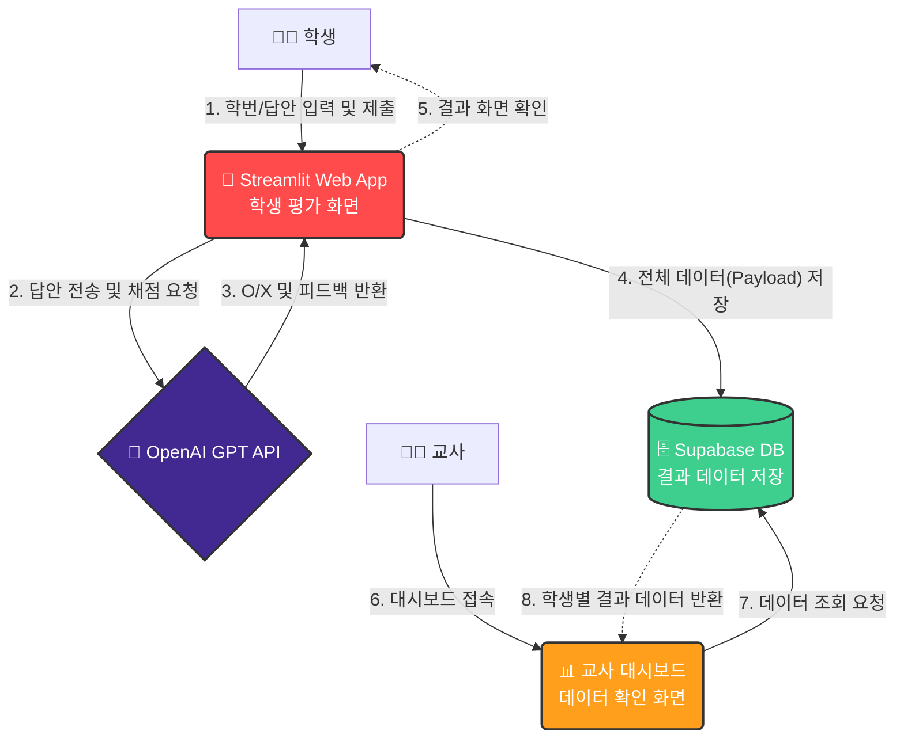
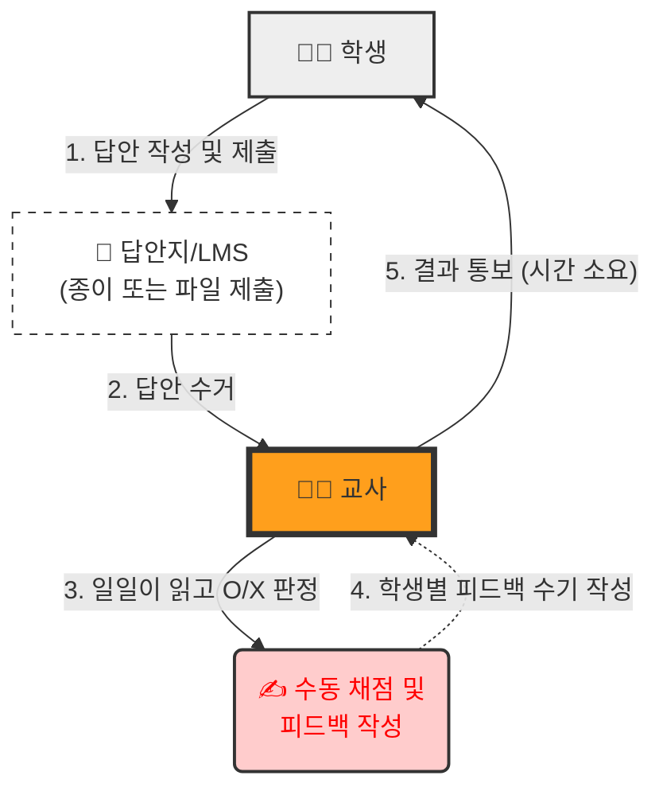

# 📝 Streamlit 서술형 평가 앱 (with GPT-5 Feedback)

**교사 연수용 단일 파일(`app.py`) 서술형 평가 및 AI 피드백 시스템 예시입니다.**

---

## 🧐 프로젝트 개요

이 프로젝트는 학생들이 서술형 답안을 제출하면, OpenAI GPT API가 즉시 채점(O/X)하고 피드백을 제공하는 웹 애플리케이션입니다.

### 왜 이 도구가 필요한가요? (업무 흐름 비교)

AI와 데이터베이스를 도입했을 때 교사의 업무가 어떻게 변화하는지 시각적으로 비교해 보세요.

#### 1. To-Be: AI 도입 모델 (제안 방식)
교사는 평가 업무에서 해방되어 **대시보드 모니터링**에 집중할 수 있으며, 데이터는 자동으로 축적됩니다.

